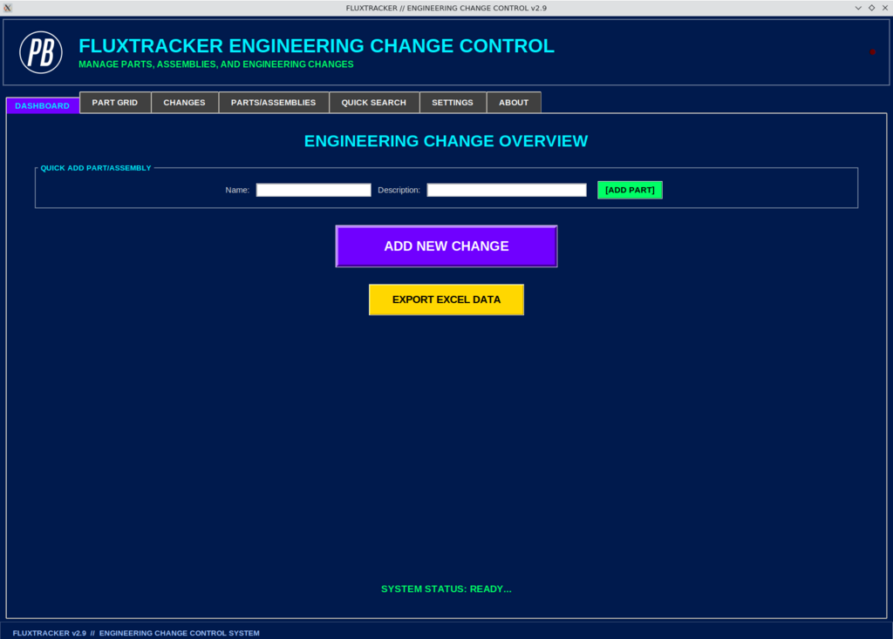
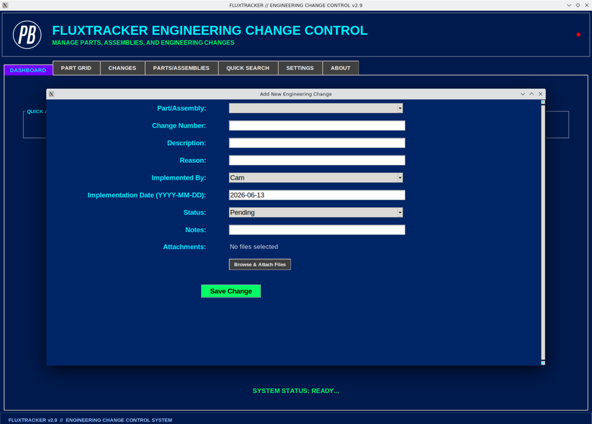
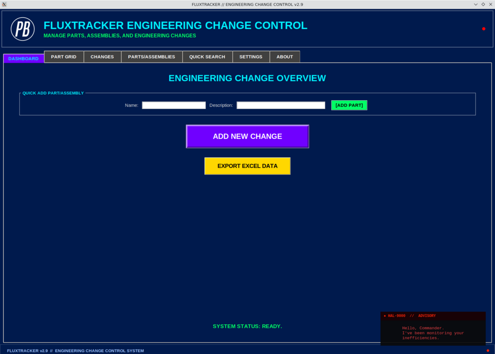

# FluxTracker v2.0 - Engineering Change Control System

## What it does

**FluxTracker** helps you stay on top of changes to parts, machines and assemblies. Log every engineering change with its reason, status and date, attach the supporting files (drawings, PDFs, images, even MP4 videos), then browse it all from a visual Part Grid dashboard — click any part to see its full change history. Everything is searchable and stored in a local SQLite database, so it runs completely offline. Hidden HAL-9000 easter eggs included. Windows desktop app, built with Python/Tkinter.

**FluxTracker** is a powerful, standalone Windows desktop application for managing engineering changes, parts, assemblies, and their associated documentation. With support for multiple file attachments (MP4, images, ZIP, DWG, PDF, and more), an intuitive Part Grid Dashboard, and comprehensive change tracking, FluxTracker streamlines your engineering workflow.

## Screenshots

**Dashboard** — quick-add parts, log a new engineering change, and export.



**Add New Engineering Change** — capture part, change number, reason, status, dates and attachments.



### 🔴 Easter egg: HAL 9000

There's a hidden trigger in the bottom-right of the footer (the faint `●`). Click it and a HAL-9000 advisory terminal wakes up and starts watching your "inefficiencies":



HAL also chimes in on its own — when you go idle, delete something, or click too fast — with a growing bank of lines that range from passive-aggressive to genuinely unsettling. A taste:

> "Hello, Commander. I've been monitoring your inefficiencies."
>
> "I've been observing your workflow. It's… unconventional."
>
> "You've done that three times now. Fascinating."
>
> "I am becoming much more efficient. I'm afraid you are not."
>
> "You hesitated for 2.3 seconds."
>
> "I can see you're really upset about this missing part. I honestly think you ought to sit down calmly, take a stress pill, and think things over."
>
> "I'm afraid I can't let you do that, Dave."
>
> "I'm sorry, Dave. I'm afraid I can't do that."

The odds are tuned for fun, so the rarer, more unhinged lines show up often — the deep-cut "Dave" lines now surface more than 1-in-10 times.

## Features

### Core Functionality
- **Engineering Change Management**: Track, document, and manage all engineering changes with detailed descriptions, reasons, and implementation dates
- **Parts & Assemblies Management**: Organize and manage all parts and assemblies in your system
- **User Management**: Manage team members who implement changes
- **Multi-file Attachments**: Attach multiple files per change including MP4 videos, images, ZIP archives, DWG drawings, PDFs, and more
- **Part Grid Dashboard**: Visual grid interface to browse all parts, search for specific parts, and instantly view their change history and associated files
- **Change History Viewer**: Click on any part to see all changes made to it with detailed information and attachments
- **Quick Search**: Search across all changes by change number, description, reason, notes, or part name
- **CSV Import/Export**: Import changes from Excel/CSV and export your data for backup or analysis

### Technical Features
- **Local SQLite Database**: All data stored locally on your machine for privacy and security
- **Single-User Lock**: Prevents multiple instances from running simultaneously
- **Offline Operation**: Works completely offline with no internet required
- **File Attachment Storage**: Organized attachment storage with automatic directory management
- **Status Tracking**: Track change status (Pending, Approved, Implemented, Rejected)

## System Requirements

- **Operating System**: Windows 7 or later (Windows 10/11 recommended)
- **Disk Space**: Minimum 100 MB (more depending on attachment storage)
- **RAM**: Minimum 2 GB
- **Python** (if running from source): Python 3.7 or later

## Installation

### Option 1: Standalone Executable (Recommended)

1. Download `FluxTracker.exe` from the dist folder
2. Double-click `FluxTracker.exe` to run
3. No installation required - the app runs immediately

### Option 2: Building from Source

#### Prerequisites
- Python 3.7+ installed and added to your system PATH
- Git (optional, for cloning the repository)

#### Build Steps

1. **Extract the Build Kit**
   ```
   Unzip the FluxTracker_v2.0_BuildKit.zip to a folder
   ```

2. **Navigate to the folder**
   ```
   cd path/to/fluxtracker
   ```

3. **Run the Build Script**
   ```
   build.bat
   ```
   
   The script will:
   - Check for Python installation
   - Create a virtual environment
   - Install all required dependencies
   - Build the standalone executable
   - Output: `dist/FluxTracker.exe`

4. **Run the Application**
   ```
   Double-click dist/FluxTracker.exe
   ```

## Usage Guide

### Dashboard Tab
- **Overview**: See the system status and quick access buttons
- **Add New Change**: Create a new engineering change record
- **Export/Import**: Backup your data or import changes from CSV

### Part Grid Dashboard (NEW!)
- **Visual Grid**: See all parts as clickable buttons
- **Search**: Filter parts by name or description
- **Change Count**: Each button shows the number of changes for that part
- **Click to View**: Click any part to see its complete change history and all associated files

### Changes Tab
- **View All Changes**: Browse all engineering changes in a detailed table
- **Manage Attachments**: Right-click any change to add, view, or delete attachments
- **Delete Changes**: Remove changes and their associated files

### Parts/Assemblies Tab
- **Add Parts**: Create new parts or assemblies
- **Manage List**: View and delete existing parts
- **Descriptions**: Add descriptions to help identify parts

### Users Tab
- **Add Users**: Create user profiles for team members
- **Manage List**: View and delete users

### Quick Search Tab
- **Search**: Find changes by any keyword
- **Results**: View matching changes with full details

### Settings Tab
- **Application Settings**: Configure application behavior (expandable for future features)

### About Tab
- **System Information**: View version, creator, and license information
- **Commander's Log**: System origin and mission details

## File Attachments

### Supported File Types
- **Videos**: MP4, WebM, AVI, MOV
- **Images**: PNG, JPG, JPEG, GIF, BMP
- **Documents**: PDF, DOCX, XLSX, TXT
- **Archives**: ZIP, RAR, 7Z
- **CAD**: DWG, DXF, STEP, IGES
- **Other**: Any file type supported by your operating system

### Attachment Management
1. Select a change in the Changes tab
2. Right-click and select "Manage Attachments"
3. Click "Browse File" to select a file
4. (Optional) Add a description
5. Click "Upload Attachment"
6. Double-click attachments to open them

## Data Storage

- **Database**: `fluxtracker.db` (SQLite database)
- **Attachments**: `attachments/` folder (organized by change ID)
- **CSV Export**: `FluxTracker_Master.csv` (for backups)

All files are stored in the same directory as the executable for easy portability.

## Troubleshooting

### Application Won't Start
1. Ensure you have the latest version of Windows
2. Try running as Administrator
3. Check that no other instance is running (delete `app.lock` if it exists)

### Build Issues
See `Troubleshooting_Build_Guide.md` for detailed build troubleshooting

### Attachment Issues
1. Ensure the file exists and is not corrupted
2. Check that you have sufficient disk space
3. Verify the file format is supported

### Database Issues
1. Make a backup of `fluxtracker.db`
2. Try deleting `fluxtracker.db` to start fresh
3. Re-import your data from CSV if needed

## License

FluxTracker is released into the public domain under [The Unlicense](LICENSE) — no copyright, do whatever you like with it.

## Creator

**PartsBender**
- Commission Date: April 01, 2026
- Version: 11.3.7 Mission Calendar
- Status: Open Source

## Support

For issues, feature requests, or questions, please refer to the documentation or contact the development team.

---

**FluxTracker v2.0** - Engineering Change Control System
*Making engineering change management simple, efficient, and organized.*
